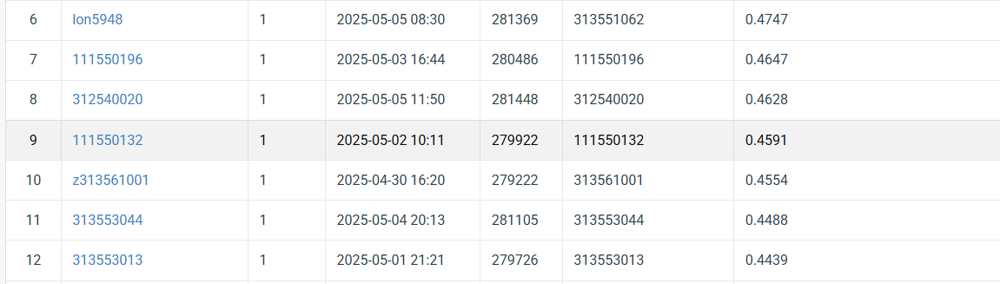

# NYCU VRDL 2025 Spring HW3

StudentID: 111550132

Name: 張家睿

## Introduction
Use ConvNeXt-Base as the backbone of the Mask R-CNN model. The FPN 
takes feature1, feature3, feature5, and feature7 from ConvNeXt-Base as its 
inputs.
#### Single model:
* training model: [code/train.py](code/train.py)
* testing model: [code/test.py](code/test.py)
* drawing confusion matrix: [code/confusion_matrix.py](code/confusion_matrix.py)
* analyize number of features: [code/plot_num_features_histogram.py](code/plot_num_features_histogram.py)

## How to install
Download the [environment.yaml](environment.yaml), execute this lines in a computer with conda.
```
conda env create -f environment.yaml -n env
# after creating env
conda activate env
python code/train.py
```

## Performance snapshot
